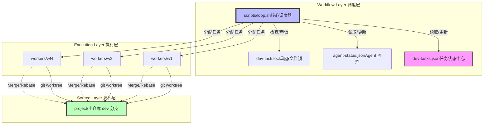
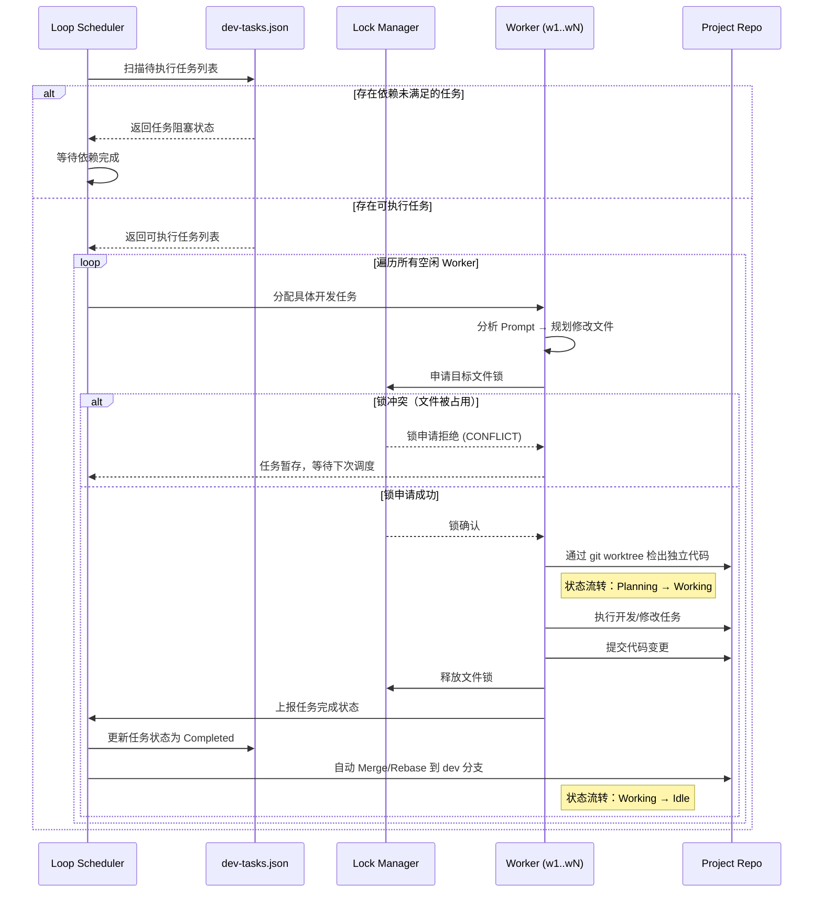

<div align="center">

# 🚀 Multi-Agent Workflow 

**面向多 Worker 并行开发的智能调度中枢**  
*调度与执行解耦 | 动态锁机制 | 实时状态监控*

<p>
  
  
  
  
  
  
</p>


</div>

---

## 🎯 项目简介

Multi-Agent Workflow 是一套为**大规模并行开发**设计的智能调度系统，通过解耦调度逻辑与业务执行、引入动态文件锁机制、实现全生命周期状态监控，最大化开发效率，最小化协作冲突。

无论你是管理多团队并行开发，还是构建自动化 CI/CD 流水线，这个调度中枢都能为你提供稳定、高效、可扩展的任务编排能力。

---

## 🏗️ 架构全景



---

## ✨ 核心特性

| 特性 | 详情 | 优势 |
|------|------|------|
| 🎯 **调度执行解耦** | `workflow/` 纯调度逻辑，`project/` 纯业务代码，物理隔离 | 职责清晰，互不干扰，易于维护 |
| 🔒 **动态锁机制** | 运行时分析文件依赖，自动生成 `dev-task.lock` | 最大化并行度，避免代码冲突 |
| 📊 **实时状态监控** | 全生命周期状态追踪（Planning → Working → Idle） | 故障可定位，日志可追溯 |
| ⚡ **一键式操作** | 提供 `reboot.sh` 一键重置环境 | 降低使用门槛，快速恢复状态 |
| 🔄 **Git Worktree 集成** | 多 Worker 共享主仓库，独立工作区 | 高效利用 Git 生态，避免代码冗余 |
| 🛡️ **故障自愈** | 心跳检测 + 自动重试机制 | 提升系统稳定性，减少人工干预 |

---

## 🚀 快速开始

### 环境要求
- Bash 4.0+
- Git 2.17+
- jq 1.6+ (用于 JSON 解析)

### 方式一：一键启动（推荐）

```bash
# 克隆仓库
git clone https://github.com/your-username/multi-agent-workflow.git
cd multi-agent-workflow

# 强力重置：回滚代码 → 重置状态 → 初始化环境
bash scripts/reboot.sh
```

### 方式二：手动控制

<details>
<summary>🔧 分步操作（适合自定义配置）</summary>

```bash
# 1. 初始化环境（配置检查 + 依赖安装 + 目录创建）
bash scripts/init.sh

# 2. 启动核心调度循环（后台常驻）
nohup bash scripts/loop.sh > logs/loop.log 2>&1 &

# 3. 实时监控调度日志
tail -f logs/loop.log

# 4. 查看 Worker 状态
cat agent-status.json | jq .
```
</details>

---

## 📁 项目结构

```
multi-agent-workflow/
├── 🎛️ workflow/                 # 调度中枢核心
│   ├── 📋 dev-tasks.json        # 任务单一数据源（核心配置）
│   ├── 🔒 dev-task.lock         # 动态文件锁（运行时自动生成）
│   ├── 👁️ agent-status.json     # Agent 实时状态监控
│   ├── 📖 AGENT.md              # Agent 操作手册（详细文档）
│   ├── 📊 PLAN.md               # 全局技术规划与最佳实践
│   ├── ⚙️ config/
│   │   └── workflow.env         # 环境变量配置（可自定义）
│   ├── 📜 scripts/              # 核心脚本
│   │   ├── 🔄 loop.sh           # 核心调度循环 ⭐
│   │   ├── 💥 reboot.sh         # 一键重置（推荐使用）
│   │   ├── ⚠️ git-reset.sh      # 代码回滚工具
│   │   └── 🧹 reset.sh          # 状态清理工具
│   └── 📝 logs/                 # 运行日志（自动生成）
│       ├── loop.log             # 调度器日志
│       └── w*.log               # 各 Worker 执行日志
│
├── 💼 project/                  # 业务代码主仓库（独立管理）
│   └── 📂 [你的业务代码目录]
│
└── 👷 workers/                  # Agent 工作区（自动生成）
    ├── w1/                      # Worker 1 独立工作区
    ├── w2/                      # Worker 2 独立工作区
    └── wN/                      # Worker N 独立工作区
```

---

## 🔄 工作流机制



---

## ⚙️ 核心配置说明

### 任务定义 (`dev-tasks.json`)
```json
{
  "tasks": [
    {
      "id": "feature-login",
      "type": "feature",
      "prompt": "实现用户登录模块，包含账号密码验证、JWT 生成、权限校验",
      "target_files": ["src/auth/login.ts", "src/auth/types.ts", "src/utils/token.ts"],
      "dependencies": ["task-init", "feature-common-utils"],
      "priority": "high",
      "estimated_time": "30m",
      "status": "pending"
    },
    {
      "id": "bugfix-logout",
      "type": "bugfix",
      "prompt": "修复登出后 Token 未清空的问题",
      "target_files": ["src/auth/logout.ts"],
      "dependencies": ["feature-login"],
      "priority": "critical",
      "estimated_time": "10m",
      "status": "pending"
    }
  ],
  "config": {
    "max_parallel_workers": 4,
    "auto_merge": true,
    "conflict_strategy": "rebase",
    "heartbeat_interval": "30s",
    "log_level": "info"
  }
}
```

### Agent 状态监控 (`agent-status.json`)
```json
{
  "last_updated": "2026-03-04T10:15:30Z",
  "workers": [
    {
      "id": "w1",
      "status": "working",
      "current_task": "feature-login",
      "locked_files": ["src/auth/login.ts", "src/auth/types.ts"],
      "started_at": "2026-03-04T10:00:00Z",
      "heartbeat": "2026-03-04T10:14:45Z",
      "log_file": "logs/w1.log"
    },
    {
      "id": "w2",
      "status": "idle",
      "current_task": null,
      "locked_files": [],
      "started_at": null,
      "heartbeat": "2026-03-04T10:15:00Z",
      "log_file": "logs/w2.log"
    }
  ]
}
```

---

## 📊 监控与运维

### 实时监控面板
```bash
# 1. 看板模式：实时查看 Worker 状态
watch -n 1 'cat agent-status.json | jq ".workers[] | {id, status, current_task}"'

# 2. 过滤关键日志：只看任务分配/完成/冲突
tail -f logs/loop.log | grep -E "(ASSIGNED|COMPLETED|CONFLICT|ERROR)"

# 3. 查看任务执行时长
jq '.tasks[] | {id, status, estimated_time}' dev-tasks.json
```

### 故障排查

| 问题现象 | 可能原因 | 解决方案 |
|----------|----------|----------|
| `CONFLICT` 频繁出现 | 文件锁粒度太粗 / 任务依赖设计不合理 | 细化 `target_files` 粒度，调整任务依赖关系 |
| Worker 状态一直是 `working` 无心跳 | Worker 进程卡死 / 网络问题 | 执行 `bash scripts/reset.sh w1` 重置指定 Worker |
| Git 合并失败 | 代码冲突 / 分支不一致 | 手动解决冲突后执行 `bash scripts/git-reset.sh` |
| 调度器不分配任务 | `dev-tasks.json` 格式错误 / 无空闲 Worker | 检查 JSON 格式，增加 Worker 数量或等待任务完成 |

---

## 🤝 贡献指南

我们非常欢迎社区贡献！无论是修复 Bug、添加新功能，还是优化文档，都可以按照以下步骤参与：

1. **Fork** 本仓库到你的 GitHub 账号
2. 创建特性分支 (`git checkout -b feature/YourFeatureName`)
3. 提交你的修改 (`git commit -m 'feat: add some amazing feature'`)
4. 推送到分支 (`git push origin feature/YourFeatureName`)
5. 打开 **Pull Request**，描述你的修改内容

### 贡献规范
- 代码风格：遵循 ShellCheck 规范，确保脚本可移植性
- 提交信息：使用 [Conventional Commits](https://www.conventionalcommits.org/) 规范
- 文档更新：修改功能时同步更新相关文档

---

## 📜 开源协议

本项目基于 **MIT 协议** 开源 - 详见 [LICENSE](LICENSE) 文件。

---

<div align="center">

### 🌟 如果你觉得这个项目有帮助，欢迎 Star ⭐️

**[⬆ 回到顶部](#-multi-agent-workflow)**

Made with ❤️ by [Your Name](https://github.com/your-username)

</div>
    